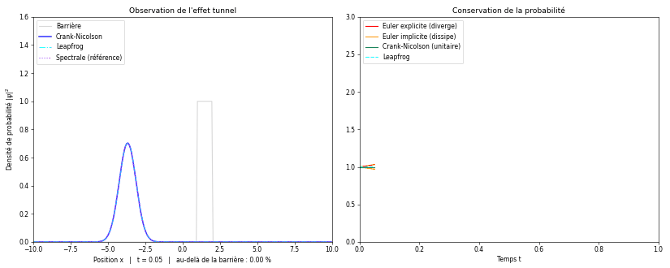
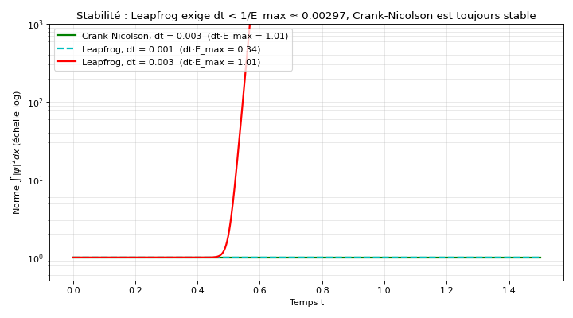

# Équation de Schrödinger 1D : effet tunnel et schémas numériques

Propagation d'un paquet d'ondes quantique vers une barrière de potentiel plus haute que son énergie moyenne : une partie de la probabilité **traverse la barrière**, ce qui serait impossible pour une particule classique. Le projet compare **quatre schémas d'intégration en temps** et une méthode spectrale de référence, en suivant la conservation de la probabilité.



*À gauche : densité de probabilité |ψ|² et barrière (en gris). À droite : probabilité totale ∫|ψ|² dx au cours du temps pour chaque schéma. L'animation va jusqu'à t = 10 : le paquet se sépare sur la barrière vers t ≈ 1, puis les ondes rebondissent sur les bords du domaine et interfèrent.*

> **En bref**
> - La probabilité totale doit rester égale à 1 : c'est le critère qui départage les schémas numériques.
> - Euler explicite diverge, Euler implicite dissipe la probabilité, Crank-Nicolson la conserve exactement, Leapfrog la conserve seulement si $\Delta t < 1/E_{max} \approx 0{,}003$.
> - Environ 7,5 % du paquet traverse la barrière. L'analyse montre que l'essentiel vient des composantes d'énergie supérieure à la barrière, l'effet tunnel pur ne comptant que pour environ 0,5 %.
> - Crank-Nicolson se superpose à la solution spectrale exacte : c'est la méthode de référence pour ce problème.

## Sommaire

1. [Objectif](#1-objectif)
2. [Physique](#2-physique)
3. [Discrétisation spatiale](#3-discrétisation-spatiale)
4. [Schémas d'intégration en temps](#4-schémas-dintégration-en-temps)
5. [Implémentation](#5-implémentation)
6. [Résultats et analyse](#6-résultats-et-analyse)
7. [Limites et pistes](#7-limites-et-pistes)
8. [Lancer le code](#8-lancer-le-code)
9. [Références](#9-références)

---

## 1. Objectif

Résoudre numériquement l'équation de Schrödinger dépendant du temps pour une particule qui rencontre une barrière de potentiel, et :

- **observer l'effet tunnel** et mesurer la probabilité de transmission ;
- **comparer les schémas numériques** du point de vue de la stabilité et de la conservation de la probabilité, propriété fondamentale de la mécanique quantique.

## 2. Physique

### Équation de Schrödinger

L'évolution de la fonction d'onde $\psi(x, t)$ d'une particule de masse $m$ est régie par :

$$i\hbar\thinspace\frac{\partial \psi}{\partial t} = H\psi, \qquad H = -\frac{\hbar^2}{2m}\frac{\partial^2}{\partial x^2} + V(x)$$

On travaille en unités atomiques, $\hbar = m = 1$, d'où $H = -\frac{1}{2}\partial_x^2 + V(x)$.

### Interprétation probabiliste

D'après l'interprétation de Born, $|\psi(x, t)|^2$ est la densité de probabilité de présence. La particule étant forcément quelque part :

$$\int |\psi(x, t)|^2\thinspace  dx = 1 \quad \text{à tout instant}$$

### Opérateur d'évolution

$H$ ne dépendant pas du temps, la solution s'écrit $\psi(t) = U(t)\thinspace\psi(0)$ avec $U(t) = e^{-iHt}$. Comme $H$ est hermitien, $U$ est **unitaire** ($U^\dagger U = I$) : c'est ce qui garantit la conservation de la probabilité. Tout l'enjeu numérique est d'approcher $e^{-iH\Delta t}$ par une formule discrète qui préserve cette unitarité.

### La barrière et l'effet tunnel

La barrière est rectangulaire, de hauteur $V_0 = 30$ entre $x = 1$ et $x = 2$ (largeur $a = 1$). Classiquement, une particule d'énergie $E < V_0$ est entièrement réfléchie. En mécanique quantique, la fonction d'onde décroît exponentiellement dans la barrière sans s'y annuler, et une fraction ressort de l'autre côté.

Pour une onde plane d'énergie $E$, le coefficient de transmission vaut :

$$T(E) = \left[1 + \frac{V_0^2 \sinh^2(\kappa a)}{4E(V_0 - E)}\right]^{-1}, \quad \kappa = \sqrt{2(V_0 - E)} \qquad (E < V_0)$$

$$T(E) = \left[1 + \frac{V_0^2 \sin^2(k' a)}{4E(E - V_0)}\right]^{-1}, \quad k' = \sqrt{2(E - V_0)} \qquad (E > V_0)$$

Pour $E > V_0$, la transmission n'est pas totale non plus : une partie de l'onde est réfléchie, ce qui est également un effet quantique.

### Le paquet d'ondes

La particule est représentée par un paquet gaussien, localisé en $x_0 = -4$ et se déplaçant vers la barrière avec le vecteur d'onde $k_0 = 7$ :

$$\psi(x, 0) \propto \exp\left(-\frac{(x - x_0)^2}{2\sigma^2}\right) e^{ik_0 x}, \qquad \sigma = 0{,}8$$

Son énergie centrale vaut $k_0^2/2 = 24{,}5 < V_0$. Mais un paquet localisé contient une **distribution d'impulsions** : $|\tilde\psi(k)|^2 \propto \exp(-\sigma^2 (k - k_0)^2)$, d'écart-type $1/(\sigma\sqrt{2}) \approx 0{,}88$. Environ 20 % de ses composantes ont un vecteur d'onde supérieur à $\sqrt{2V_0} \approx 7{,}75$, donc une énergie supérieure à la barrière (voir l'analyse en partie 6).

## 3. Discrétisation spatiale

Le domaine $[-10, 10]$ est discrétisé sur $N = 250$ points ($\Delta x \approx 0{,}080$). La dérivée seconde est approchée par différences finies centrées :

$$\frac{\partial^2 \psi}{\partial x^2}(x_i) \approx \frac{\psi_{i+1} - 2\psi_i + \psi_{i-1}}{\Delta x^2}$$

L'hamiltonien devient une **matrice tridiagonale** $N \times N$ :

- diagonale : $H_{ii} = 1/\Delta x^2 + V(x_i)$ ;
- sur- et sous-diagonales : $H_{i,i\pm1} = -1/(2\Delta x^2)$.

La matrice s'arrêtant aux bords, tout se passe comme si $\psi = 0$ juste au-delà du domaine : ce sont des murs infinis (conditions de Dirichlet). Le domaine est choisi assez large pour que le paquet n'atteigne pas ces murs pendant la phase étudiée.

Conséquence de la discrétisation : une onde $e^{ikx}$ a pour énergie $E(k) = (1 - \cos k\Delta x)/\Delta x^2$ au lieu de $k^2/2$. L'écart est faible pour les petits $k$, mais abaisse un peu l'énergie des composantes rapides : à $k = 7{,}75$, on obtient $E \approx 29$ au lieu de 30.

## 4. Schémas d'intégration en temps

### Les schémas

| Schéma | Mise à jour | Ordre |
|---|---|---|
| Euler explicite | $\psi^{n+1} = (I - i\Delta t\thinspace H)\thinspace\psi^n$ | 1 |
| Euler implicite | $(I + i\Delta t\thinspace H)\thinspace\psi^{n+1} = \psi^n$ | 1 |
| Crank-Nicolson | $\left(I + \tfrac{i\Delta t}{2}H\right)\psi^{n+1} = \left(I - \tfrac{i\Delta t}{2}H\right)\psi^n$ | 2 |
| Leapfrog (saute-mouton) | $\psi^{n+1} = \psi^{n-1} - 2i\Delta t\thinspace H\thinspace\psi^n$ | 2 |
| Spectrale | $\psi(t) = \sum_n c_n\thinspace e^{-iE_n t}\thinspace\varphi_n$ | exacte |

Crank-Nicolson est la moyenne des deux schémas d'Euler ; il correspond à l'approximation de Cayley $e^{-iH\Delta t} \approx (I + \tfrac{i\Delta t}{2}H)^{-1}(I - \tfrac{i\Delta t}{2}H)$. La méthode spectrale diagonalise $H$ ($H\varphi_n = E_n\varphi_n$) : chaque mode propre tourne simplement en phase, sans aucune erreur en temps.

### Analyse de stabilité

$H$ étant hermitien, on peut étudier chaque schéma mode propre par mode propre. Pour un mode d'énergie $E$, un pas de temps multiplie son amplitude par un **facteur d'amplification** $g$ ; la norme est conservée si $\lvert g \rvert = 1$ pour tous les modes.

| Schéma | Facteur $g$ pour un mode d'énergie $E$ | Module | Conséquence |
|---|---|---|---|
| Exact | $e^{-iE\Delta t}$ | $1$ | référence |
| Euler explicite | $1 - iE\Delta t$ | $\sqrt{1 + E^2\Delta t^2} > 1$ | la norme croît à chaque pas : **instable** quel que soit $\Delta t$ |
| Euler implicite | $1/(1 + iE\Delta t)$ | $1/\sqrt{1 + E^2\Delta t^2} < 1$ | la norme décroît : **stable mais dissipatif** |
| Crank-Nicolson | $\dfrac{1 - iE\Delta t/2}{1 + iE\Delta t/2}$ | $1$ exactement | **unitaire**, stable pour tout $\Delta t$ |
| Leapfrog | racines de $g^2 + 2iE\Delta t\thinspace g - 1 = 0$ | $1$ si $E\Delta t \le 1$, sinon $E\Delta t + \sqrt{E^2\Delta t^2 - 1} > 1$ | **stable sous condition** : $\Delta t < 1/E_{max}$ |

Pour Leapfrog, la condition porte sur la plus grande énergie propre $E_{max}$ de la matrice $H$. Pour une particule libre, $E_{max} = 2/\Delta x^2$, d'où la condition classique $\Delta t < \Delta x^2/2 \approx 0{,}0032$. Le potentiel $V_0$ augmente $E_{max}$ : ici $E_{max} \approx 337$, d'où $\Delta t < 0{,}00297$. C'est ce qui a imposé le choix $\Delta t = 0{,}001$.

## 5. Implémentation

### Paramètres

| Paramètre | Valeur | Rôle |
|---|---|---|
| `L` | 10 | demi-largeur du domaine $[-10, 10]$ |
| `N` | 250 | nombre de points ($\Delta x \approx 0{,}080$) |
| `dt` | 0,001 | pas de temps, imposé par la stabilité de Leapfrog |
| `V0` | 30 | hauteur de la barrière, entre $x = 1$ et $x = 2$ |
| `x0`, `sigma`, `k0` | −4 ; 0,8 ; 7 | position, largeur et vecteur d'onde du paquet initial |

### Déroulement

1. **État initial** : paquet gaussien, normalisé pour que $\sum_i |\psi_i|^2\thinspace\Delta x = 1$.
2. **Construction de $H$** (matrice tridiagonale) et de l'identité $I$.
3. **Pré-calculs** : les inverses $(I + i\Delta t H)^{-1}$ (Euler implicite) et $(I + \tfrac{i\Delta t}{2} H)^{-1}$ (Crank-Nicolson) sont calculés **une seule fois** avant la boucle. Les recalculer à chaque pas (coût en $O(N^3)$) rendait l'animation beaucoup trop lente ; ensuite, chaque pas ne coûte qu'un produit matrice-vecteur.
4. **Méthode spectrale** : $H$ est diagonalisée une fois (`np.linalg.eigh`), et $\psi(0)$ est projetée sur la base propre.
5. **Démarrage de Leapfrog** : ce schéma à trois niveaux a besoin de $\psi^0$ et $\psi^1$ ; le premier pas est fait avec Crank-Nicolson.
6. **Boucle d'animation** : 25 pas de temps par image. À chaque pas, les quatre schémas avancent et on enregistre la norme de chacun. Euler explicite et Leapfrog sont gelés si leur norme dépasse 10, pour éviter un dépassement numérique.
7. **Transmission** : à chaque image, on calcule $\sum_{x_i > 2} |\psi_i|^2\thinspace\Delta x$ avec Crank-Nicolson.

Une seconde figure relance Crank-Nicolson et Leapfrog avec $\Delta t = 0{,}001$ et $\Delta t = 0{,}003$ pour illustrer la condition de stabilité.

## 6. Résultats et analyse

### Dynamique du paquet

Le paquet se déplace vers la barrière en s'étalant progressivement : c'est la **dispersion**, conséquence de la relation d'incertitude (un paquet localisé contient plusieurs impulsions, qui avancent à des vitesses différentes). Au contact de la barrière, il se sépare en une onde réfléchie, majoritaire, et une onde transmise, visible comme une petite bosse à droite de la barrière. Aux temps longs (au-delà de $t \approx 2$, visibles dans la seconde moitié de l'animation), les ondes rebondissent sur les bords du domaine, reviennent frapper la barrière et forment des franges d'interférence : l'onde se superpose à ses propres réflexions. L'écart entre franges, environ $\pi/k_0 \approx 0{,}45$, correspond à la superposition de deux ondes de vecteurs d'onde opposés $\pm k_0$.

### Conservation de la probabilité

| Schéma | Norme à $t \approx 1{,}6$ | Commentaire |
|---|---|---|
| Euler explicite | diverge vers $t \approx 0{,}47$ | croissance lente, puis explosion quand les modes de haute énergie, plus fortement amplifiés, prennent le dessus |
| Euler implicite | ≈ 0,40 | 60 % de la probabilité a « disparu » : dissipation purement numérique |
| Crank-Nicolson | 1,000000 | unitaire, superposé à la solution spectrale |
| Leapfrog | ≈ 1 | stable avec $\Delta t = 0{,}001$ |

Ces comportements sont exactement ceux prédits par l'analyse des facteurs d'amplification (partie 4).

### Stabilité de Leapfrog



Avec $\Delta t = 0{,}001$ ($E_{max}\Delta t = 0{,}34$), Leapfrog conserve la norme. Avec $\Delta t = 0{,}003$, à peine au-dessus de la limite ($E_{max}\Delta t = 1{,}01$), la norme reste à 1 pendant environ 150 pas puis explose. Les quelques modes de très haute énergie pour lesquels $E\Delta t > 1$ ont un facteur d'amplification supérieur à 1 ; presque absents au départ (au niveau des erreurs d'arrondi), ils sont amplifiés à chaque pas jusqu'à dominer la solution. Avec le même $\Delta t = 0{,}003$, Crank-Nicolson reste parfaitement unitaire : il est inconditionnellement stable.

### Analyse de la transmission

À $t \approx 1{,}6$, environ **7,5 %** de la probabilité se trouve au-delà de la barrière. D'où vient ce chiffre ?

- Pour une onde plane à l'énergie centrale $E = 24{,}5$, la formule de la partie 2 donne $T \approx 0{,}3$ % seulement.
- Mais environ 20 % des composantes du paquet ont une énergie supérieure à $V_0$ et passent avec une probabilité élevée.
- En moyennant $T(E)$ sur la distribution en impulsion du paquet, et en tenant compte de la discrétisation (relation de dispersion $E(k)$ de la partie 3, barrière de 13 points de grille), on obtient environ 8 %, en bon accord avec la simulation.
- Dans ce total, la part des composantes d'énergie **inférieure** à $V_0$, c'est-à-dire l'effet tunnel au sens strict, n'est que d'environ 0,5 %.

La transmission observée mélange donc effet tunnel et transmission au-dessus de la barrière, et la seconde domine avec ces paramètres. Pour isoler l'effet tunnel, il faudrait un paquet plus étroit en impulsion (plus large en position, $\sigma$ plus grand) ou une barrière plus haute par rapport à $k_0^2/2$.

## 7. Limites et pistes

- **Réflexions sur les bords** : les murs implicites de la matrice renvoient les ondes vers la barrière après $t \approx 2$. Une couche absorbante (potentiel imaginaire aux bords, ou PML) permettrait des simulations longues.
- **Matrices pleines** : pour $N = 250$, stocker et inverser des matrices $N \times N$ est acceptable. Pour des maillages plus fins, il faut exploiter la structure tridiagonale : Crank-Nicolson se résout alors en $O(N)$ par pas (`scipy.linalg.solve_banded` ou matrices creuses).
- **Mesure de transmission** : elle est prise à un instant donné. Une étude systématique de $T$ en fonction de $V_0$, de la largeur de la barrière ou de $k_0$, comparée à la formule analytique, montrerait la décroissance exponentielle caractéristique de l'effet tunnel.
- **Extensions** : potentiels dépendant du temps, double barrière (résonances), passage en 2D (méthode ADI ou split-operator par FFT).

## 8. Lancer le code

```bash
pip install -r requirements.txt
python schrodinger_tunnel.py            # animation, puis figure de stabilité
python schrodinger_tunnel.py --sauver   # enregistre le GIF et la figure de stabilité dans figures/
```

## 9. Références

- J. Crank et P. Nicolson, *A practical method for numerical evaluation of solutions of partial differential equations of the heat-conduction type*, Proceedings of the Cambridge Philosophical Society 43, 50 (1947).
- A. Goldberg, H. M. Schey et J. L. Schwartz, *Computer-generated motion pictures of one-dimensional quantum-mechanical transmission and reflection phenomena*, American Journal of Physics 35, 177 (1967).
- C. Cohen-Tannoudji, B. Diu et F. Laloë, *Mécanique quantique*, tome 1, Hermann.
- J.-L. Basdevant et J. Dalibard, *Mécanique quantique*, Éditions de l'École polytechnique.
- W. H. Press et al., *Numerical Recipes*, Cambridge University Press (chapitre sur les équations aux dérivées partielles).

---

Projet réalisé en M1 Physique à CY Cergy Paris Université (cours « Modélisation numérique / Computational physics », mars 2026).
